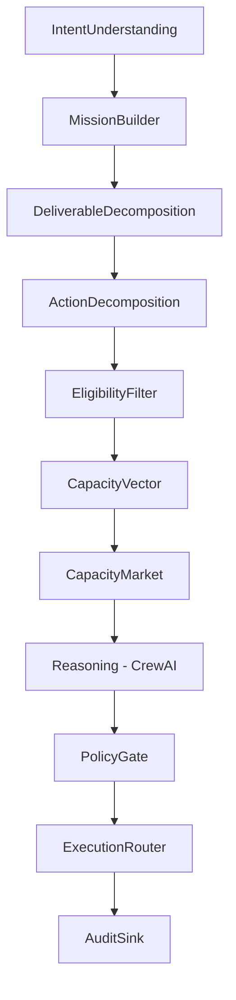

# CORTEXA AI - Task Intelligence System

> **A production-grade, intent-driven work orchestration system that replaces traditional task tracking with AI-powered work allocation.**

## Philosophy: Intent → Motion → Outcome

CORTEXA AI fundamentally reimagines work management by:
- Understanding **why** work exists (Intent)
- Deciding **what** should be done (Motion)
- Deciding **who** should do it safely (Allocation)
- Tracking **real progress** (Momentum)
- Preventing **burnout** (Capacity-aware)
- Ensuring **explainability** (Audit trail)

---

## 🎯 Core Concepts

### The New Vocabulary (Jira → CORTEXA AI)

| Old World (Jira) | CORTEXA AI (NEW) | Meaning |
|------------------|------------------|---------|
| Epic | **Mission** | Business/client intent |
| Story | **Deliverable** | Concrete outcome |
| Task | **Action** | Executable work |
| Subtask | **Step** | Atomic unit |
| Bug | **Anomaly** | Deviation |
| Sprint | **Pulse** | Time focus window |
| Backlog | **Signal Pool** | Uncommitted signals |

---

## 🏗️ Architecture

### LangGraph Control Plane (11 Nodes)



### Authority Contract

✅ **LangGraph is the Boss** - Deterministic orchestration  
✅ **CrewAI is a Thinking Sandbox** - No execution authority  
✅ **AI Never Writes to DB** - All writes through service layer  
✅ **Humans Accept Work** - No forced assignments  
✅ **Every Decision is Reversible** - Full audit trail  

---

## 🚀 Quick Start

### Prerequisites

- Python 3.11+
- PostgreSQL 14+
- Redis 7+
- OpenAI API key

### Installation

```bash
# Clone the repository
cd orbix-task-intelligence

# Install dependencies
pip install -r requirements.txt

# Or use Poetry
poetry install

# Copy environment configuration
cp .env.example .env

# Edit .env with your configuration
# OPENAI_API_KEY=your_key_here
# DATABASE_URL=postgresql+asyncpg://...
# REDIS_URL=redis://localhost:6379/0
```

### Database Setup

```bash
# Run migrations
alembic upgrade head

# Seed initial data (optional)
python scripts/seed_data.py
```

### Run the System

```bash
# Development mode
uvicorn src.api.main:app --reload --port 8000

# Production mode
uvicorn src.api.main:app --workers 4 --port 8000
```

---

## 📊 Performance SLAs

| Component | Target | Measurement |
|-----------|--------|-------------|
| Intent Understanding | <100ms | p95 latency |
| Mission Builder | <50ms | p95 latency |
| Deliverable Decomposition | <200ms | p95 latency |
| Action Decomposition | <200ms | p95 latency |
| Eligibility Filter | <50ms | p95 latency |
| Capacity Vector | <100ms | p95 latency |
| Capacity Market | Async | N/A |
| Reasoning (CrewAI) | <900ms | p95 latency |
| Policy Gate | <50ms | p95 latency |
| Execution Router | <100ms | p95 latency |
| **Total (sync path)** | **<1.5s** | **p95 end-to-end** |

---

## 🔒 Safety Guarantees

- ✅ **AI never writes to DB directly** - All writes through service layer
- ✅ **Policies gate all autonomy** - PolicyGateNode enforces rules
- ✅ **Humans accept work, not get forced** - Capacity Market pattern
- ✅ **Every decision is reversible** - Audit trail enables rollback
- ✅ **No hidden memory** - CrewAI agents are stateless
- ✅ **Explainability** - Full audit trail with justification codes
- ✅ **Fallback on failure** - LLM failure → safe default (PROPOSE mode)

---

## 🧪 Testing

```bash
# Run all tests
pytest

# Run with coverage
pytest --cov=src --cov-report=html

# Run specific test suites
pytest tests/nodes/           # Node tests
pytest tests/services/        # Service tests
pytest tests/integration/     # Integration tests
pytest tests/performance/     # Performance tests
pytest tests/safety/          # Safety tests

# Run performance benchmarks
pytest tests/performance/ --benchmark-only
```

---

## 📖 API Documentation

Once the server is running, visit:

- **Swagger UI**: http://localhost:8000/docs
- **ReDoc**: http://localhost:8000/redoc

### Key Endpoints

```bash
# Trigger intent processing
POST /api/v1/intent
{
  "description": "Build user onboarding flow",
  "documents": [],
  "meeting_notes": []
}

# Get action details
GET /api/v1/actions/{action_id}

# Respond to work offer
POST /api/v1/market/respond
{
  "action_id": "a_12345",
  "user_id": "u_67890",
  "response": "ACCEPT"
}

# Get audit trail
GET /api/v1/audit/{decision_id}
```

---

## 🎛️ Policy Configuration

Orbix supports three policy presets:

### 1. Default (Balanced)
```python
from src.config import get_default_policy_config

policy = get_default_policy_config(org_id="org_123")
```

### 2. Conservative (High Oversight)
```python
from src.config import get_conservative_policy_config

policy = get_conservative_policy_config(org_id="org_123")
# - Requires 95% confidence for auto-assign
# - Lower capacity thresholds
# - More human approvals
```

### 3. Aggressive (High Automation)
```python
from src.config import get_aggressive_policy_config

policy = get_aggressive_policy_config(org_id="org_123")
# - Accepts 70% confidence for auto-assign
# - Higher capacity thresholds
# - Minimal human intervention
```

---

## 📁 Project Structure

```
orbix-task-intelligence/
├── src/
│   ├── __init__.py
│   ├── schemas.py              # Pydantic models
│   ├── orbix_core.py           # LangGraph state machine
│   ├── nodes/                  # LangGraph nodes
│   │   ├── intent_understanding.py
│   │   ├── mission_builder.py
│   │   ├── deliverable_decomposition.py
│   │   ├── action_decomposition.py
│   │   ├── eligibility_filter.py
│   │   ├── capacity_vector.py
│   │   ├── capacity_market.py
│   │   ├── reasoning.py
│   │   ├── policy_gate.py
│   │   ├── execution_router.py
│   │   └── audit_sink.py
│   ├── crew/
│   │   └── orbix_crew.py       # CrewAI integration
│   ├── services/
│   │   ├── action_service.py
│   │   ├── capacity_service.py
│   │   └── audit_service.py
│   ├── config/
│   │   └── policies.py
│   └── api/
│       └── main.py             # FastAPI app
├── tests/
├── requirements.txt
├── pyproject.toml
└── README.md
```

---

## 🔧 Development

### Code Quality

```bash
# Format code
black src/ tests/

# Lint code
ruff check src/ tests/

# Type checking
mypy src/

# Run all checks
pre-commit run --all-files
```

### Environment Variables

See `.env.example` for all configuration options.

---

## 📈 Monitoring

Orbix includes built-in Prometheus metrics:

```bash
# Metrics endpoint
http://localhost:8000/metrics
```

**Key Metrics:**
- `orbix_node_duration_seconds` - Node execution time
- `orbix_decisions_total` - Decision counts by mode
- `orbix_capacity_market_responses` - Market response counts
- `orbix_policy_violations_total` - Policy violation counts

---

## 🤝 Contributing

This is a production-grade system. Contributions must:
1. Pass all tests (`pytest`)
2. Meet performance SLAs
3. Maintain safety guarantees
4. Include audit trail updates
5. Follow code quality standards

---

## 📄 License

Copyright © 2026 CORTEXA AI. All rights reserved.

---

## 🆘 Support

For issues, questions, or feature requests, please contact the CORTEXA AI team.

---

**Built with ❤️ by CORTEXA AI**

*This is not a demo. This is a production-grade, category-defining system.*
